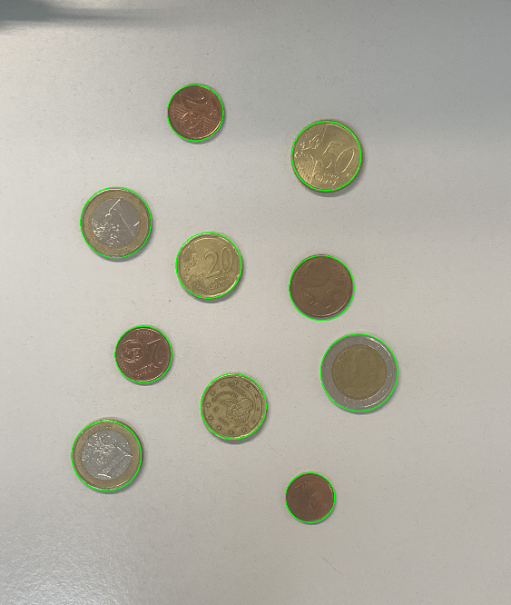

## Práctica 3. Detección y reconocimiento de formas

> Trabajo realizado por:
> - David Koschel Henríquez
> - Pablo Nicolás Santana Hernández

### Tarea 1

Para esta tarea se usó la función de la transformada de Hough para la detección de los contornos de las monedas. Se
ajustaron los parámetros para detectar únicamente las monedas. A pesar del buen resultado a la hora de detectar los
contornos, como se puede apreciar en la imagen, debido a los tamaños tan similares de las monedas la detección del valor
de la moneda no es del todo precisa.

