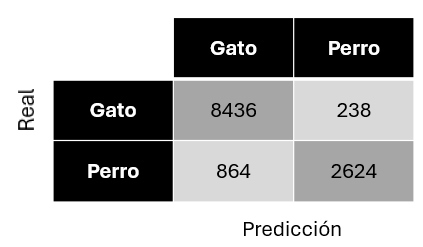
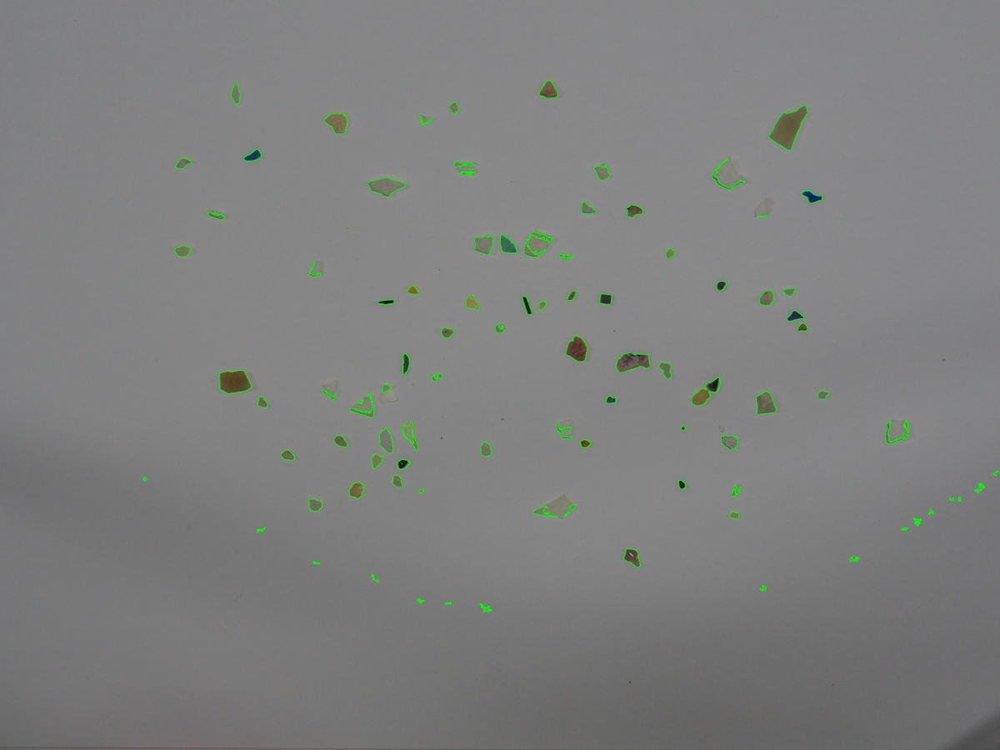

## Práctica 3. Detección y reconocimiento de formas

### Contenidos

[Aspectos cubiertos](#31-aspectos-cubiertos)  
[Entrega](#32-entrega)

### Tarea 1

Para esta tarea se usó la función de la transformada de Hough para la detección de los contornos de las monedas. Se
ajustaron los parámetros para detectar únicamente las monedas. A pesar del buen resultado a la hora de detectar los
contornos, como se puede apreciar en la imagen, debido a los tamaños tan similares de las monedas la detección del valor
de la moneda no es del todo precisa.

### 3.2. Entrega

Para la entrega de esta práctica, son dos las tareas planteadas. En la primera tarea, se asume que todos los objetos de
interés en la imagen son circulares, en concreto monedas de la UE. Tras mostrar diversas aproximaciones para obtener sus
contornos, el reto o tarea consiste en determinar la cantidad de dinero y monedas presentes en la imagen.

Para la segunda tarea, se proporcionan tres imágenes de tres clases de objetos recogidos en playas canarias: fragmentos
plásticos, *pellets* y alquitrán. Las dos primeras categorías se consideran microplásticos cuando miden menos de 5mm,
mientras que la tercera es muy habitual encontrarlas en playas canarias. Observar que dado que cada imagen contiene
muestras de una única categoría, disponen de un conjunto de datos anotado. La tarea propuesta consiste en tomar como
muestras de partida las imágenes proporcionadas, extraer de forma automatizada las partículas e identificar patrones en
sus características geométricas y de apariencia que puedan permitir la clasificación de las partículas en dichas
imágenes. El resultado obtenido debe mostrarse por medio las métricas mostradas en el cuaderno, incluyendo la matriz de
confusión, donde se comparan las anotaciones con las predicciones.

  
*Ejemplo de matriz de confusión*

A la hora de considerar posibles características geométricas, como punto de partida para la extracción de descriptores
de las partículas, se proporciona enlace al
trabajo [SMACC: A System for Microplastics Automatic Counting and Classification](https://doi.org/10.1109/ACCESS.2020.2970498)
en el que se adoptan algunas propiedades geométricas para dicho fin. De forma resumida, las características geométricas
utilizadas en dicho trabajo fueron:

- Área en píxeles (A)
- Perímetro en píxeles (P)
- Compacidad (relación del cuadrado del perímetro con el área C=P^2/A)
- Relación del área de la partícula con el área del contenedor que la contiene
- Relación del ancho y el alto del contenedor
- Relación entre los ejes de la elipse ajustada
- Definido el centroide, relación entre las distancias menor y mayor al contorno

En relación a la segmentación de las partículas, una probable primera observación es que la aplicación del umbralizado
para separarlas del fondo, es delicada. Preprocesamiento como suavizar la imagen de entrada o reducir su tamaño, o
aplicar heurísticas basadas en el tamaño mínimo y máximo de los contornos localizados, y la distancia mínima entre
ellos, pueden ayudar a filtrar falsas detecciones, pero a pesar de ello, será un desafío obtener una separación perfecta
para todas las imágenes con la misma estrategia. Añadir, que la imagen de fragmentos contiene unas 80 partículas, la de
*pellets* unas 55 y la de alquitrán unas 54.

  
*Ejemplo ilustrativo contornos detectados en la imagen de fragmentos*

Si quieren ir más allá, sugerir explorar técnicas de segmentación recientes y potentes
como [Segment anything o SAM](https://segment-anything.com) o [OneFormer](https://github.com/SHI-Labs/OneFormer), y
extensiones
como , [SAM 2](https://github.com/facebookresearch/segment-anything-2), [FastSAM](https://github.com/CASIA-IVA-Lab/FastSAM)
o [Count anything](https://github.com/ylqi/Count-Anything). No duden en compartir otras alternativas que descubran.

La entrega se realizará a través del campus virtual, remitiendo un enlace a **github**, donde se alojará el **cuaderno o
cuadernos** de resolución de las tareas, además de un **README** describiendo el proceso adoptado para resolver cada
tarea, integrando de imágenes ilustrativas, además de las métricas obtenidas y matriz de confusión de la segunda tarea.

<!---Momentos en trabajo de Nayar sobre Binary images https://cave.cs.columbia.edu/Statics/monographs/Binary%20Images%20FPCV-1-3.pdf -->

***
Bajo licencia de Creative Commons Reconocimiento - No Comercial 4.0 Internacional
